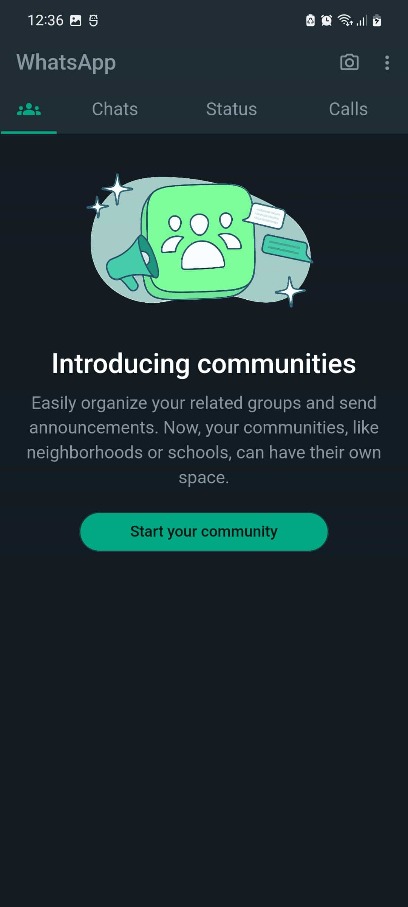
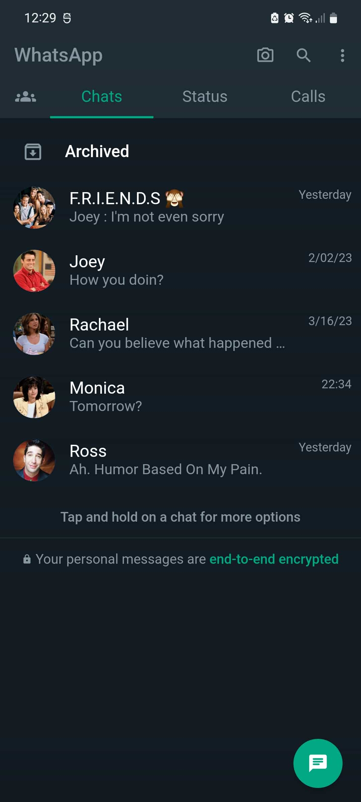
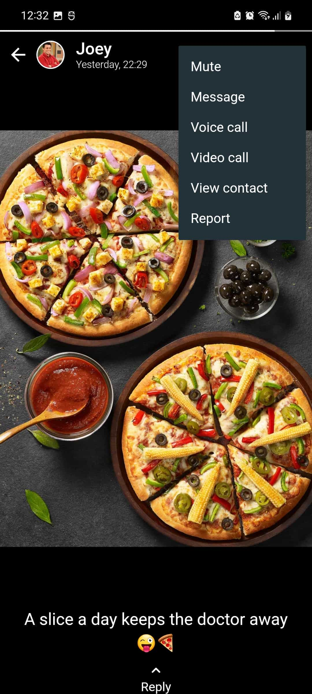
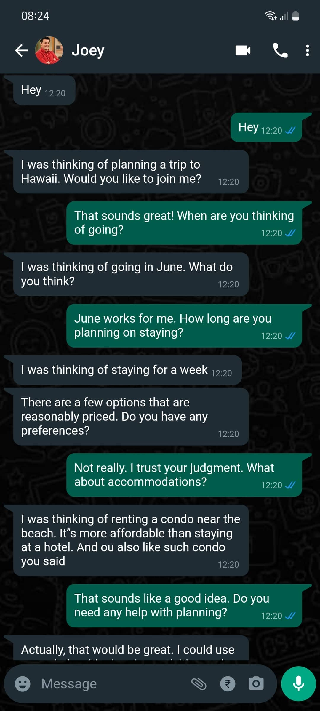
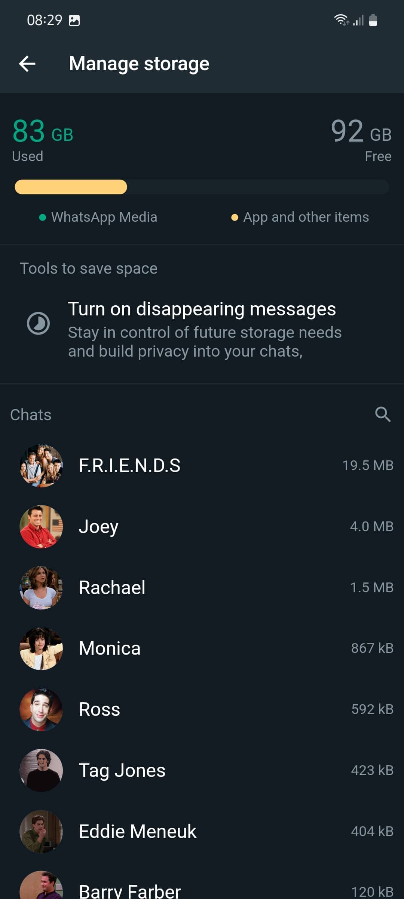
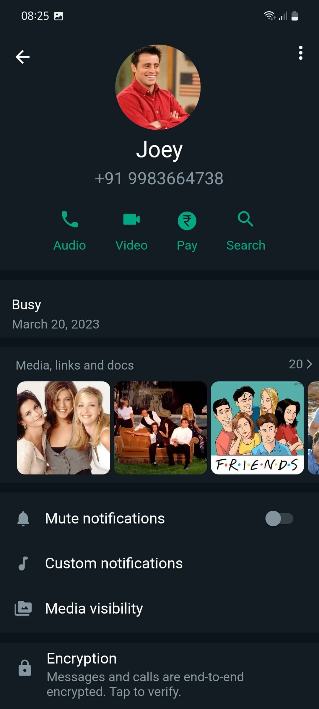
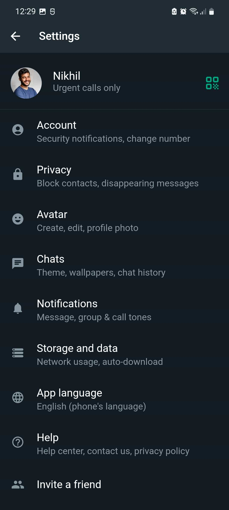
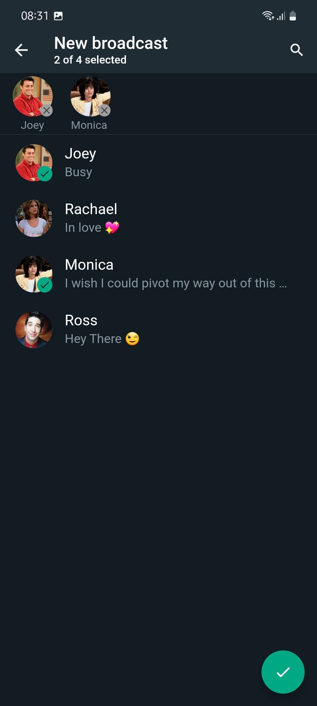

# WhatsApp UI Clone in Flutter
This is a Flutter project that aims to replicate the user interface of WhatsApp using Flutter. This project was created for educational purposes to showcase how Flutter can be used to create beautiful and functional user interfaces.

### Project Structure
 #### The project structure is organized in the following way:

* lib: contains the main Dart code for the application
* pages: contains the different screens for the application (e.g. Home, Chat, Calls, etc.)
* common: contains the various widgets used throughout the application (e.g. chat bubbles, contact cards, etc.)
* images: contains any necessary images used in the application 

### Installation
#### Clone the repository using the following command:
```bash    
git clone https://github.com/iamkartiknayak/Flutter_UI_Clone_WhatsApp_Android_App.git
```
#### Navigate to the project directory:
```bash 
cd whatsapp-clone-flutter
```
#### Install the dependencies:
```bash 
flutter pub get
```
#### Run the application:
```bash 
flutter run
```
### Screenshots

&nbsp;&nbsp;&nbsp;&nbsp;&nbsp;&nbsp;&nbsp;&nbsp;&nbsp;
&nbsp;&nbsp;&nbsp;&nbsp;&nbsp;&nbsp;&nbsp;&nbsp;&nbsp;
&nbsp;&nbsp;&nbsp;&nbsp;&nbsp;&nbsp;&nbsp;&nbsp;&nbsp;

&nbsp;&nbsp;&nbsp;&nbsp;&nbsp;&nbsp;&nbsp;&nbsp;&nbsp;
&nbsp;&nbsp;&nbsp;&nbsp;&nbsp;&nbsp;&nbsp;&nbsp;&nbsp;
&nbsp;&nbsp;&nbsp;&nbsp;&nbsp;&nbsp;&nbsp;&nbsp;&nbsp;

&nbsp;&nbsp;&nbsp;&nbsp;&nbsp;&nbsp;&nbsp;&nbsp;&nbsp;
&nbsp;&nbsp;&nbsp;&nbsp;&nbsp;&nbsp;&nbsp;&nbsp;&nbsp;
<br><br>

## Conclusion
#### This WhatsApp clone is a demonstration of how Flutter can be used to create beautiful and functional user interfaces. The code is open source and can be used as a starting point for your own Flutter projects.
