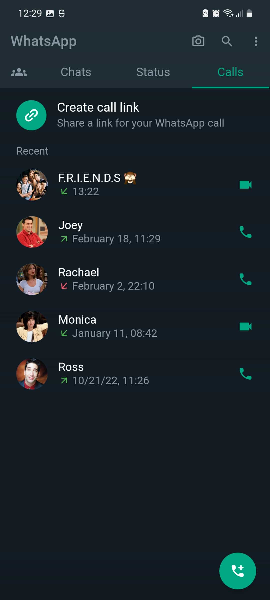

# WhatsApp UI Clone in Flutter
#### This is a Flutter project that aims to replicate the user interface of WhatsApp using Flutter. This project was created for educational purposes to showcase how Flutter can be used to create beautiful and functional user interfaces.

 

## Project Structure
 #### The project structure is organized in the following way:

 #### lib: contains the main Dart code for the application
 #### pages: contains the different screens for the application (e.g. Home, Chat, Calls, etc.)
 #### common: contains the various widgets used throughout the application (e.g. chat bubbles, contact cards, etc.)
 #### images: contains any necessary images used in the application 

 

## Installation
Clone the repository using the following command:
    
    git clone https://github.com/iamkartiknayak/UI_Flutter_WhatsApp.git

## Navigate to the project directory:
    cd whatsapp-clone-flutter

## Install the dependencies:
    flutter pub get

## Run the application:
    flutter run

 

## Features
### This WhatsApp clone includes the following features:

* ### A Home screen with a list of chats and recent updates
* ### A Chat screen where users can send and receive messages
* ### A Calls screen where users can see their call history
* ### A Contacts screen where users can see their saved contacts
* ### A Settings screen where users can adjust their app settings

 

## Screenshots
Home Screen

  

Chat Screen

  

Status Screen

  

Calls Screen

  

Settings Screen

  

## Conclusion
#### This WhatsApp clone is a demonstration of how Flutter can be used to create beautiful and functional user interfaces. The code is open source and can be used as a starting point for your own Flutter projects.
